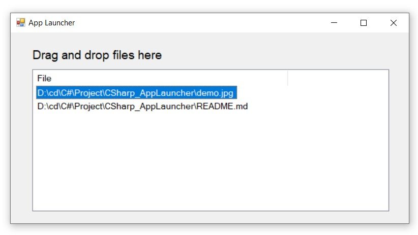

# Description
    Tool manages files by drag & drop files to main window of application, click to open file. 
    Tool supplies clear, save, load different configs.
    Tool supports recent files menu.
    
# Software
    Microsoft Visual Studio

# Source
    - AppLauncher: source code
    - AppLauncher/AppLauncher.sln: solution of project, to open the project
    - AppLauncher/bin/Debug/AppLauncher.exe: executable application
    - AppLauncher/bin/Debug/configs: include configs
    - AppLauncher/bin/Debug/recordRecentFiles.txt: save information of configs which were opened in application recently
    - demo: interface of application

# Demo
    

# Reference
    https://www.udemy.com/course/learn-c-sharp-programming-in-ten-easy-steps/