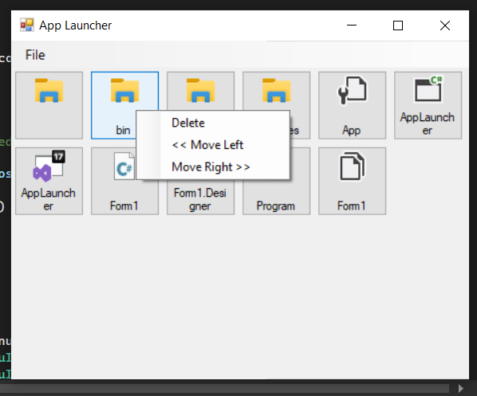

# Description
    Tool manages files by drag & drop files to main window of application, click to open file. 
    Tool supplies clear, save, load different configs, supports recent config files menu.
    Tool can delete, move files, drag files in panel.
    Save current settings of app and restore when restarting.

# Software
    Microsoft Visual Studio

# Source
    - AppLauncher: source code
    - AppLauncher/AppLauncher.sln: solution of project, to open the project
    - AppLauncher/bin/Debug/AppLauncher.exe: executable application
    - AppLauncher/bin/Debug/configs: include configs
    - AppLauncher/bin/Debug/recordRecentFiles.txt: save information of configs which were opened in application recently
    - AppLauncher/bin/Debug/AppLauncher.exe.Config: save current settings of app
    - Bonus+-+Program+Manager+Project.pdf: reference material
    - demo: interface of application

# Demo
   
   

# Reference
    https://www.udemy.com/course/learn-c-sharp-programming-in-ten-easy-steps/
